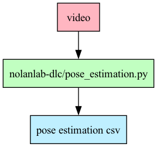

# Nolanlab DLC

Package to help run DeepLabCut in NolanLab; especially on EDDIE. The script `pose_estimate.py` takes in video files and outputs the DeepLabCut output folder. Most importantly, these contain the pose estimation in a `.csv` file. 

 

These pose estimation files are usually then syncronized for downstream analysis.

Read about the entire NolanLab pipeline: https://github.com/MattNolanLab/analysis_pipelines

This repo represents a _minimum viable product_: it contains a working DLC pipeline. But it has been forked and modified when applied to other projects in the lab. The modified repos can be found here:

- https://github.com/chrishalcrow/nolanlab-ephys (Code which applies DeepLabCut to Harry and Wolf's data can be found in `{experimenter_name}_pose_estimation.py`)

## Models and DeepLabCut

DeepLabCut applies a **model** to your video data. The model looks at each frame of a video and outputs an estimation of where something, like a body part, is. Although there are universal models, we currently still retrain our models for each experiment. There's good tutorials about how to train data on DeepLabCut's [YouTube](https://www.youtube.com/@deeplabcut7702/videos) and their [documentation](https://deeplabcut.github.io/DeepLabCut/docs/standardDeepLabCut_UserGuide.html).

There are a bunch of models in the ActiveProjects folder in the NolanLab datastore. They are:

Location | Description
---------|------------
Harry/deeplabcut/of_cohort12-krs-2024-10-30 | For top-down view of mouse in the openfield. Will give you an estimation of the mouse's position.
Harry/deeplabcut/c12_lick-chris-2024-10-03 | For side-view of mouse in VR. Tracks the tongue position.
Harry/deeplabcut/vr-hc-2024-03-14_eddie | For side-view of mouse in VR. Tracks the circumference of the pupil.

You can try these out, but it's recommended to try training your own model. This will help understand how DLC works.

When you run `pose_estimation.py` you'll need to specify which model you use. On this repo, this is done by passing the "bodypart" argument, to be either `body`, `tongue` or `eye`.

## Cropping

DeepLabCut runs a lot faster (and better! [note: proof needed from Chris]) if you crop the video to an appropriate region of interest. You can supply this to deeplabcut as a tuple of coordinates `("x", "y", "w", "h")`. `x` and `y` are the bottom left corner of your cropping box. Then `w` and `h` are the width and height of your cropping box.

```
--------------video------------------
|                                   |
|        <---- w ---->              |
|        --crop--box-- ^            |
|        |           | |            |
|        |           | h            |
|        |           | |            |
|      y ------------- v            |
|        x                          |
|                                   |
-------------------------------------
```


## Use on your own computer

To begin using this repo, please download (clone) the repo from github and **c**hange **d**irectory into the folder

```
git clone https://github.com/MattNolanLab/nolanlab-dlc
cd nolanlab-dlc
```

Then you can run anything you'd like using (`uv`)[https://docs.astral.sh/uv/getting-started/installation/] e.g.

```
uv run pose_estimation.py --mouse 5 --day 4 --session of1 --bodypart body
```

Read more about the `pose_estimation.py` script by opening the file: there's lots of documentation inside.

